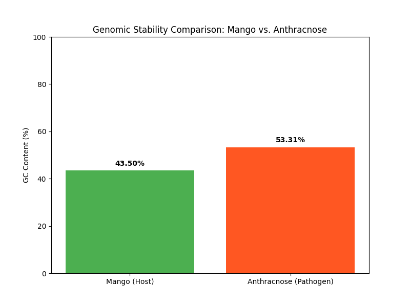

# 🥭 Bio-Estate: Pathogen Genomic Analyzer

A bioinformatics tool designed to detect genomic signatures of **Anthracnose** in mango crops through comparative GC-content analysis.

## 📊 Project Overview
This project analyzes the DNA stability (GC-content) of fungal pathogens versus their host plants. By identifying these "Genetic Gaps," we can better understand pathogen resilience in tropical climates.

### Current Analysis: Mango vs. Anthracnose
- **Host (Mango):** 43.50% GC
- **Pathogen (Colletotrichum):** 53.31% GC
- **Visual Evidence:**

## 🛠️ Tech Stack
- **Language:** Python 3.x
- **Libraries:** Matplotlib (Visualization), Biopython (Planned)
- **Deployment:** Docker (Containerization in progress)

## 🚀 How to Run
1. Clone the repo.
2. Ensure `anthracnose.fasta` is in the directory.
3. Run `python3 pathogen_analyzer.py`.